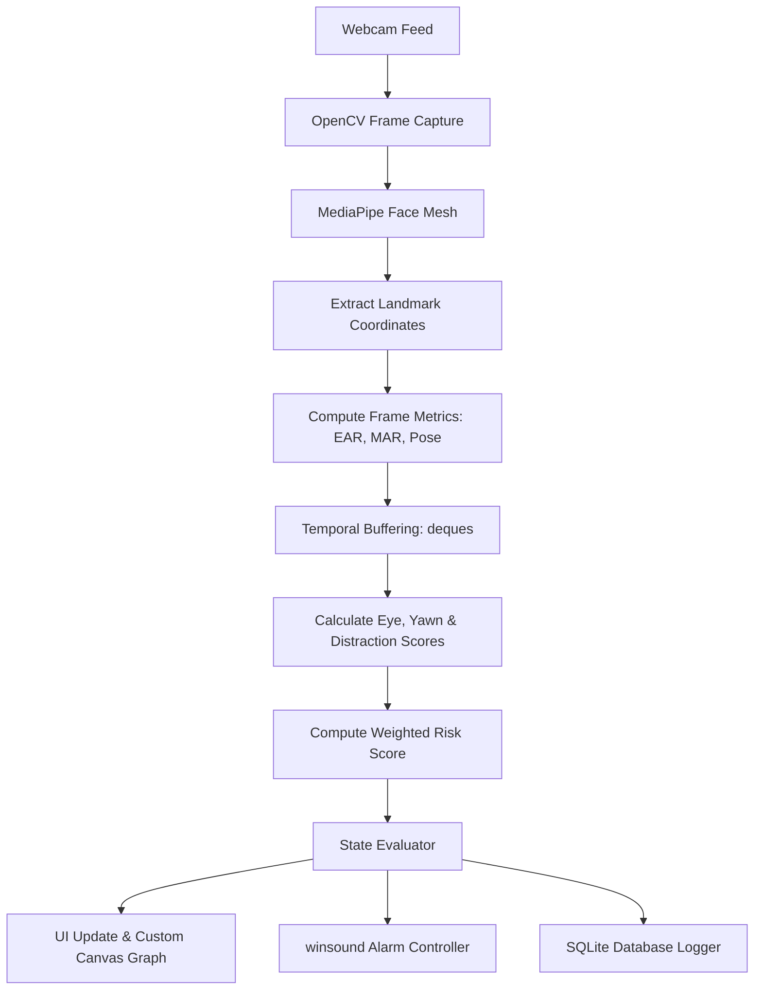

# ADAS - Driver Drowsiness & Distraction Detection System

A production-grade edge AI Driver Safety system that monitors driver attention in real-time. It processes webcam video to extract facial landmarks, performs temporal buffering to smooth data, calculates ADAS-style weighted risk indicators, triggers alarms, and logs incidents to a database.

---

## 📐 System Architecture & Core ML Logic



### 1. Metric Calculations
- **Eye Aspect Ratio (EAR)**: Monitors average eye closure.
  $$\text{EAR} = \frac{\|p_2 - p_6\| + \|p_3 - p_5\| + \|p_{mid\_top} - p_{mid\_bottom}\|}{3 \cdot \|p_1 - p_4\|}$$
- **Mouth Aspect Ratio (MAR)**: Monitors mouth opening to detect yawning.
  $$\text{MAR} = \frac{\|p_{top} - p_{bottom}\|}{3 \cdot \|p_{left} - p_{right}\|}$$
- **Head Pose Estimation**: Uses standard 3D generic head mapping against 2D landmark locations via `cv2.solvePnP` to resolve head yaw (shaking head left/right) and pitch (head tilting down/up).
### 2. Temporal Buffering & ADAS Weighted Score
To filter out transient noise (such as standard quick blinks), rolling frames are buffered (`collections.deque`):
- `ear_history`: last 45 frames (~1.5s at 30fps)
- `mar_history`: last 30 frames (~1.0s at 30fps)
- `yaw_history` / `pitch_history`: last 45 frames (~1.5s at 30fps)

Sub-scores ($S_e, S_y, S_d$ scaled $0.0 - 1.0$) represent continuous time thresholds exceeding base parameters. The aggregate **Risk Score** ($R$) is calculated as:
$$R = (S_{eye} \times 0.5 + S_{yawn} \times 0.2 + S_{distraction} \times 0.3) \times 100$$

Risk levels are mapped to system states:
- **`0 - 30` SAFE**: Normal state, Green HUD overlay, no alarms.
- **`31 - 60` WARNING**: Attention warning, Amber HUD overlay, periodic beeps.
- **`61 - 80` DROWSY**: Elevated danger, Orange HUD overlay, looping alarm.
- **`81 - 100` CRITICAL**: Critical danger, flashing Red HUD overlay, continuous alarm, auto-saved to SQLite logs.

---

## 📂 Project Structure

- **`detector.py`**: Interfacing with MediaPipe Tasks API (`FaceLandmarker`). Downloads model, extracts landmarks, computes EAR/MAR/Pose, manages buffers, and resolves risk score state.
- **`audio.py`**: Thread-safe audio alerts controller utilizing the native Windows `winsound` library. Tracks total alarm beep counts.
- **`database.py`**: Local SQLite database interface (`drowsiness_logs.db`) to record safety events and store session driver photos (capped at 5, auto-pruning the oldest).
- **`ui.py`**: CustomTkinter desktop application containing a Home screen (with last driver's photo and session distraction count) and a main monitor page (real-time camera feed, metric sliders, calibration options, and a custom canvas line graph).
- **`main.py`**: Desktop application launcher script.
- **`web_app.py`**: Streamlit web-based implementation with client-side WebRTC streaming (`streamlit-webrtc`).
- **`requirements.txt`**: Package dependencies.
- **`beep.wav`**: Alarm audio clip.

---

## 🛠️ Setup & Run Instructions

### 1. Prerequisites
Ensure you have Python 3.10+ (tested on Python 3.14/3.13) installed on Windows.

### 2. Installation
Clone the repository and install dependencies:
```bash
pip install -r requirements.txt
```

### 3. Run Desktop Application (GUI Dashboard)
```bash
python main.py
```
- **Home Screen**: Displays the last driver's photo and the total distractions counted from their session. Click **"Start Monitoring Session"** to open the camera and start the monitor.
- **Webcam**: Captures feed (auto-detects cameras). Annotates face landmarks and overlays a 3D coordinate axis on the nose tip.
- **Calibration**: Click **"Calibrate Eyes"** and look straight for 3 seconds to set a personalized EAR baseline.
- **Settings & Exit**: Manually configure metric trigger levels using the panel sliders. Click **"Exit Session"** to cleanly shut down the camera/detector and return to the Home page, saving your session's photo and distraction count.

### 4. Run Streamlit Portal (Web deployment)
To start the web version locally:
```bash
python -m streamlit run web_app.py
```
*(Streamlit Cloud builds automatically when pushed to GitHub using `requirements.txt` and `packages.txt`).*